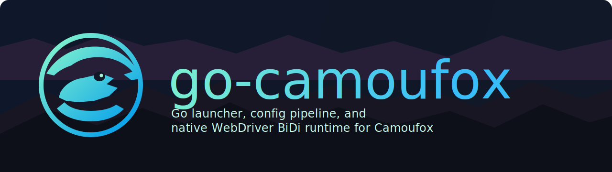

<p align="center">
  
</p>

<p align="center">
  <strong>Go launcher, config pipeline, and native WebDriver BiDi runtime for Camoufox.</strong>
</p>

<p align="center">
  <a href="https://github.com/brainplusplus/go-camoufox/releases/tag/v0.1.0">v0.1.0</a>
  &middot;
  <a href="https://github.com/daijro/camoufox">Upstream Camoufox</a>
  &middot;
  <a href="examples/README.md">Examples</a>
  &middot;
  <a href="docs/api.md">Docs</a>
</p>

`go-camoufox` ports the Python Camoufox launch/config pipeline into Go and adds
a native WebDriver BiDi server path for multi-language browser automation.

Current release target: `0.1.0`.

## At A Glance

- Use the upstream Camoufox browser binary from [daijro/camoufox](https://github.com/daijro/camoufox).
- Launch Camoufox from Go without Python in the main runtime path.
- Expose a WebDriver BiDi endpoint that other languages and agents can attach to.
- Keep a Playwright-compatible Go API alongside the native BiDi server path.

## Why This Exists

Python Camoufox from [daijro/camoufox](https://github.com/daijro/camoufox) is
already useful and battle-tested. `go-camoufox` exists because some teams need
the same Camoufox browser behavior in environments where a Go binary is easier
to run, ship, or embed than a Python launcher.

The main motivations are:

- Reduce launcher/runtime overhead for Go-heavy tooling and automation stacks.
- Make it easier to expose Camoufox as a single process with a WebDriver BiDi
  endpoint for other languages and agents.
- Fit better into Go services, goroutine-based worker pools, and containerized
  workloads that want fewer moving parts around the launcher layer.
- Keep the Camoufox browser binary itself unchanged while replacing the Python
  orchestration layer with Go.

This project does **not** replace the C++ browser patches that make Camoufox
Camoufox. It still relies on the upstream Camoufox Firefox binary and release
artifacts.

## How It Differs From Python Camoufox

At a high level, Python Camoufox and `go-camoufox` aim at the same browser
target but take different approaches in the launcher layer.

Python Camoufox:

- Is the upstream reference implementation.
- Has the most mature API surface and real-world compatibility today.
- Feels natural if your automation stack is already Python + Playwright.
- Is the best baseline when you want the closest thing to official upstream
  behavior without translating concepts across runtimes.

`go-camoufox`:

- Reimplements the launcher/config pipeline in Go.
- Keeps a Playwright-compatible Go API for convenience.
- Adds a native WebDriver BiDi server path so other languages can connect over
  WebSocket without Python in the main runtime path.
- Is better suited to Go-based worker systems, embedded services, and
  agent-oriented automation infrastructure.

In practice, the biggest conceptual difference is this:

- Python Camoufox is primarily a Python library with launcher helpers.
- `go-camoufox` is primarily a Go launcher/runtime wrapper around the same
  browser binary, with BiDi exposure as a first-class path.

## Pros And Cons

Pros of `go-camoufox`:

- Easier to embed in Go applications and worker services.
- Native WebDriver BiDi server path for multi-language clients.
- Single compiled launcher binary is convenient for distribution.
- Natural fit for concurrency-heavy Go workloads and browser pooling.
- Good base for agent tooling that wants a long-lived browser endpoint.

Cons of `go-camoufox`:

- Upstream Python Camoufox is still the reference, so parity work is ongoing.
- Some ecosystem examples and assumptions still center on Python first.
- Client-library behavior around BiDi can vary, especially outside raw BiDi
  flows.
- Release availability is currently limited by what the configured Camoufox
  repos expose.
- If your team is already happy with Python Camoufox, switching may add moving
  parts without enough upside.

When to choose Python Camoufox:

- You want the upstream implementation with the least translation risk.
- Your team already works in Python and Playwright.
- You care more about maturity and upstream symmetry than Go integration.

When to choose `go-camoufox`:

- You want Camoufox inside a Go service, CLI, pool, or agent runtime.
- You want to expose one BiDi endpoint and let other languages attach.
- You want a launcher binary that fits better into Go-first deployment flows.

## Status

This project is usable for early adopters, examples, and smoke automation. It
is not yet a `1.0` parity claim.

Implemented:

- Camoufox launch option builder with embedded config/fingerprint assets.
- Browser install/cache helpers.
- Playwright compatibility launch API.
- Native WebDriver BiDi server and CLI command.
- Browser pool, GeoIP/locale helpers, virtual display support, addon helpers.
- Cross-platform build workflow for Linux, macOS, and Windows.
- Docker runtime scaffold.

Known limitations:

- Live smoke has been verified with an installed `135.0.1-beta.24` Camoufox
  binary. The sprint manifest references `v150.0.2-beta.25`, but the current
  configured release list does not resolve that version.
- The native BiDi path is a Go launcher/gateway to Firefox Remote Agent. It
  does not reimplement every WebDriver BiDi command itself.
- Some client libraries assume WebDriver Classic session semantics; raw BiDi
  examples are the most reliable compatibility baseline.
- Docker build requires a running Docker daemon and a fetched/mounted browser
  cache, or `GO_CAMOUFOX_FETCH_ON_START=1`.

## Install Browser

List available releases:

```bash
go run ./cmd/go-camoufox fetch --list
```

Fetch the latest configured release:

```bash
go run ./cmd/go-camoufox fetch
```

List installed browsers:

```bash
go run ./cmd/go-camoufox list
```

## Native WebDriver BiDi Server

Start a local server:

```bash
go run ./cmd/go-camoufox server --headless --no-default-addons --os windows --i-know-what-im-doing
```

The endpoint is printed to stdout:

```text
ws://127.0.0.1:50123/session
```

Use it with examples:

```bash
export CAMOUFOX_BIDI_ENDPOINT=ws://127.0.0.1:50123/session
go run ./examples/go/web_form_demo
```

PowerShell:

```powershell
$env:CAMOUFOX_BIDI_ENDPOINT = "ws://127.0.0.1:50123/session"
go run ./examples/go/web_form_demo
```

For Docker or remote access, bind explicitly:

```bash
go run ./cmd/go-camoufox server --listen 0.0.0.0:9222 --headless --no-default-addons --os windows --i-know-what-im-doing
```

Do not expose a BiDi port to the public internet without network isolation.

## Go API

Playwright compatibility path:

```go
headless := camoufox.HeadlessTrue
browser, err := camoufox.New(ctx, &camoufox.LaunchOptions{
    Headless: &headless,
    OS:       []string{"windows"},
})
if err != nil {
    log.Fatal(err)
}
defer browser.Close(ctx)
```

Native BiDi server:

```go
built, err := camoufox.BuildLaunchOptions(opts)
server, err := camoufox.LaunchServerHandle(ctx, built)
fmt.Println(server.Endpoint())
defer server.Close()
```

## Examples

- `examples/reference_ports/creepjs_playwright`: Go port of the Python CreepJS example.
- `examples/reference_ports/creepjs_bidi`: Native BiDi version of the CreepJS example.
- `examples/reference_ports/httpbin_concurrent_playwright`: goroutine version of the async Python example.
- `examples/go/web_form_demo`: deterministic local form automation.
- `examples/python/*` and `examples/node/*`: raw BiDi public-site and form examples.

See [examples/README.md](examples/README.md).

## Docker

Build:

```bash
docker build -t go-camoufox:local .
```

Run:

```bash
docker run --rm -it -p 9222:9222 \
  -e GO_CAMOUFOX_FETCH_ON_START=1 \
  -v go-camoufox-cache:/home/camoufox/.cache/go-camoufox \
  go-camoufox:local
```

Endpoint:

```text
ws://127.0.0.1:9222/session
```

See [docs/docker.md](docs/docker.md).

## Release Check

Full local check:

```powershell
.\scripts\release-check.ps1
```

Without Docker build:

```powershell
.\scripts\release-check.ps1 -SkipDockerBuild
```

With live browser smoke:

```powershell
.\scripts\release-check.ps1 -SkipDockerBuild -Live -Executable "C:\path\to\camoufox.exe"
```

## Documentation

- [Agent guide](docs/agent-guide.md)
- [CLI reference](docs/cli.md)
- [Go API reference](docs/api.md)
- [Docker](docs/docker.md)
- [Migration from Python](docs/migration.md)
